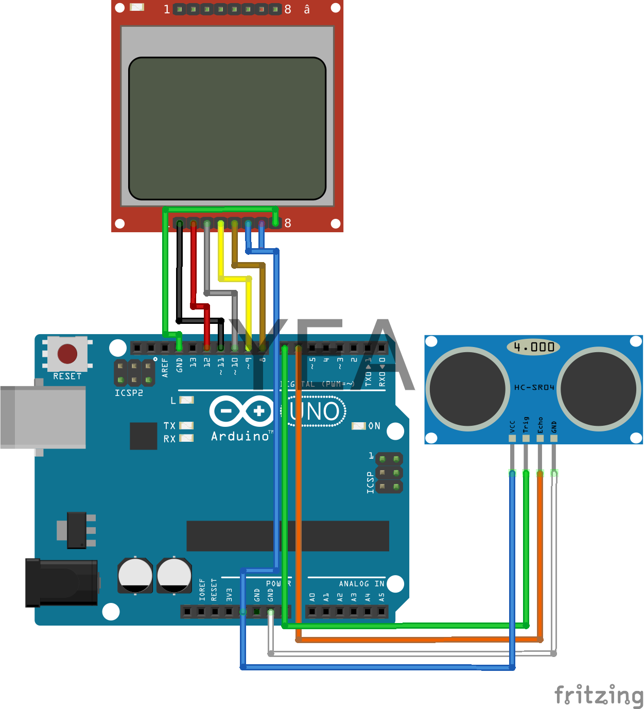

# Arduino Distance Sensor structure!   
Arduino and Nokia 5110 LCD screen, HC-SR04 distance sensor structure!

## Materials;
1. Arduino UNO
2. Nokia 5110 LCD
3. Breadboard
4. Sundry Jumper Kablo
5. HC-SR04

> **Note:** For library installations: Check the "Library installation.txt **" file.
Türkçe Kaynak için: https://www.editordefteri.tk/2020/06/29/arduino-mesafe-sensoru-yapimi/
### Schema

